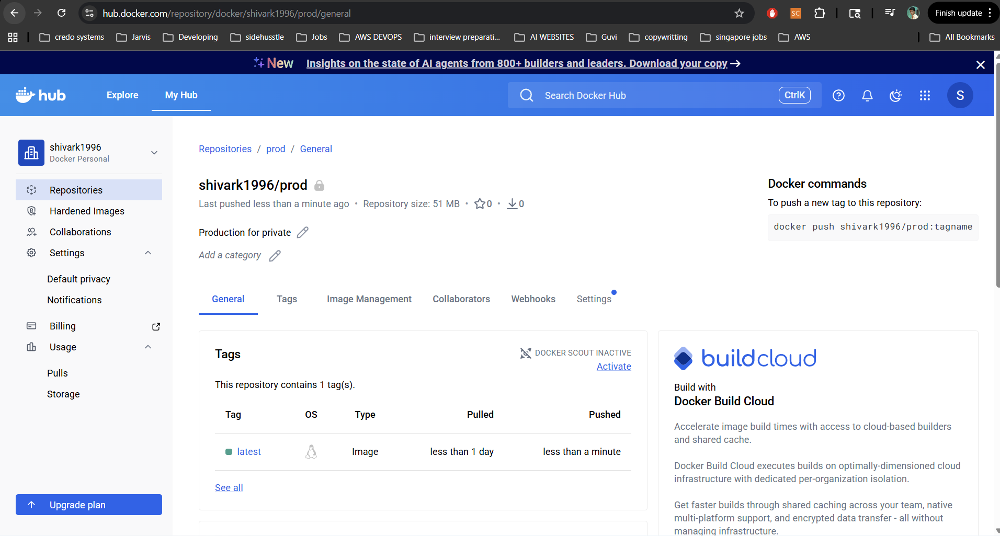

# 🚀 DevOps CI/CD Pipeline – Dockerized Application on AWS EC2

## 📌 Overview

This project implements a production-style **CI/CD pipeline** that automates the build, containerization, deployment, and monitoring of a web application using modern DevOps tools.

The system demonstrates real-world DevOps practices including:
- Continuous Integration using Jenkins
- Containerization using Docker
- Image management using Docker Hub
- Automated deployment on AWS EC2
- Infrastructure monitoring using Uptime Kuma

---

## 🧭 End-to-End CI/CD Pipeline Flow

```
GitHub (Source Code)
        ↓
Jenkins (CI/CD Pipeline)
        ↓
Docker Build Stage
        ↓
Docker Hub (Image Registry)
        ↓
AWS EC2 (Production Server)
        ↓
Docker / Docker Compose Runtime
        ↓
Web Application (Port 80 - Public Access)
        ↓
Uptime Kuma (Health Monitoring)

```
## 📂 Project Structure

```text
.
├── Dockerfile
├── docker-compose.yml
├── Jenkinsfile
├── build.sh
├── deploy.sh
├── .dockerignore
├── .gitignore
└── build/

```

## 🐳 Docker Hub Image


